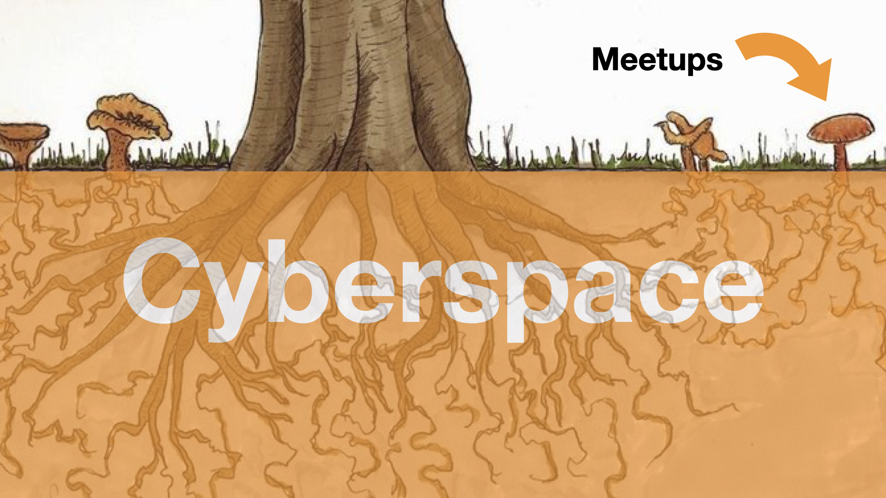

Provide an open space so others can easily join and participate.

However, and this is important, this open space should be in
[cyberspace](#cyberspace), **not** in meatspace. Meatspace can come later,
[meetups](#meetups) and all.

Meatspace doesn't scale. Cyberspace does.

## Cyberspace

Use whatever works. Here is what worked for others:

- [Telegram](https://telegram.org/)
- [Matrix](https://element.io)
- [nostr](https://nostr-resources.com)
- etc.

## Meetups

I can't stress this enough:

- **Don't start with meetups.**
- Or, more accuratly: don't expect meetups to scale.

Here is one way to think about it: Meetups GROW OUT OF CYBERSPACE.

Don't get me wrong. Meetups are great. However, they don't scale. Not on their own.

You have to build the network in cyberspace.
You have to [create a beacon](/beacon).
You have to focus on [cyberspace first](#cyberspace).
Don't know where to start? Have a look at the [blueprint](/blueprint).

Also, consider going on a [PlebWalk](https://plebwalks.com/) instead of going through the hassle of organizing a meetup.
