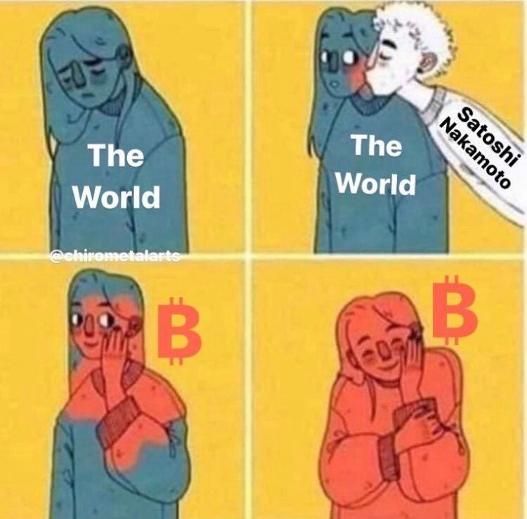

Are you creating bitcoin-only content in your native language? Is your thing called "twentyone" in whatever language you are speaking? Congratulations, you have a twentyone fork!

<small>(If you choose a different name, that's cool too.)</small>

But seriously, we want to encourage you to copy the concept that worked for us
and modify it to your needs. In other words: to fork it.

## The Motivation

Many countries still lack bitcoin-only content that is available in their native
languages, as well as bitcoin-only communities that are regional and free of
shitcoinery. 

Germany was such a country as recently as 2018, which is why we launched
EINUNDZWANZIG, a German bitcoin-only podcast that evolved into ... I don't know
what, exactly—a community, a media power-house, a bitcoiner love-fest, a
non-profit, and a million different side-projects—but it definitely evolved into
something pretty awesome, something that is worth spreading.

## The Name

Twentyone, translated into your language: [einundzwanzig], [yirmibir], [dvadeset
jedan], veinte uno, [njëzet e një][nen], douăzeci și unu, huszonegy, ventuno,
dwadzieścia jeden, tjugoett, είκοσι ένα, vingt-et-un, etc.

[einundzwanzig]: https://twitter.com/_einundzwanzig_
[yirmibir]: https://twitter.com/YirmibirBitcoin
[dvadeset jedan]: https://twitter.com/dvadesetjedan21/
[nen]: https://twitter.com/_njezetenje

## The Concept

The idea is simple: provide high-quality bitcoin-only content and create a space
for bitcoiners in your country to connect, collaborate, and exchange ideas. 

- Create a bitcoin-only beacon[^create]
- Translate the best bitcoin material to your native language[^translate]
- Involve others once they find you[^involve]

[^create]: For us, this was a [weekly podcast](https://einundzwanzig.space/podcast/)
[^translate]: For us, this was the Bitcoin Standard and many other [bitcoin resources](https://bitcoin-resources.com). The guys from [Aprycot Media](https://aprycot.media/) helped a ton.
[^involve]: For us, this was the [Telegram community chat](https://einundzwanzig.space/telegram/).

Everything else will grow organically from there. At least that's what happened
in our case. We are still blown away by the response we got and keep getting,
which is why we are open-sourcing [the concept that worked for us][concept]. Feel free to
[copy the logo][logo] and the name, by the way.

    <a href="https://github.com/twentyone-world/twentyone-world.github.io/blob/main/CONTRIBUTING.md">
        <button type="button" class="btn btn-primary btn-large btn-custom">Add Your Fork</button>
    </a>

[concept]: https://einundzwanzig.space/files/EINUNDZWANZIG-WhatWorkedForUs.pdf
[logo]: https://einundzwanzig.space/media/

## The Trick

There isn't one trick. There are three:

1. Do something public, something that scales.
2. Be consistent. Whatever you do, stick with it.
3. DON'T TRY TO DO EVERYTHING ON YOUR OWN!

Re (1): I believe that a weekly or bi-weekly podcast is perfect in terms of
scalability. It isn't that much work to produce, and it is something that can be
easily found, easily consumed, and scales almost indefinitely. Other formats,
such as a newsletter, probably work well too. But it's hard to beat the
in-person character of a podcast. **Find another bitcoiner** and just shoot the shit
or discuss the news for an hour every week. 

Re (2): This is probably the hardest part, but **consistency is key**. Whatever you
do, stick with it for a couple of months. You will be surprised how many
bitcoiners are waiting in the shadows, just waiting to discover your beacon.

Re (3): I can't stress this enough, so I'll go all caps once more: DON'T TRY TO
DO EVERYTHING ON YOUR OWN. Really. Just don't. Involve at least another person.
Think of it as your gym buddy: there will be times when you're not feeling it,
and your gym buddy will be there for you to motivate you and give you a kick in
the butt. Seriously, go find a bitcoiner that speaks your language and start as
a team straight away. This should go without saying, but since bitcoin is for
enemies, I'll say it out loud anyway: it should be someone that you like.

Once you're 21 weeks in—probably earlier—other people will find you, and by the
love of Satoshi, they will probably be happy to get involved too. That's one of
the side-effects of the orange pill: it makes people want to do bitcoin stuff.

TL;DR: Find quality people, and trust that something great will emerge through
self-organization and spontaneous order. 

## The Community

Bitcoin is different things to different people. Every country, every community,
every family, and every individual has different wants and needs and a different
understanding of what Bitcoin is and what it might be in the future.

Consequently, we have a saying: "Twentyone is what *you* make of it."

Different folks will want to work on or emphasize different things, and that's
perfectly fine. Let them, and more importantly: encourage them!

## The Meme

[← Back to the map](/)

---
